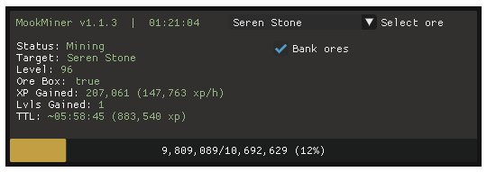

# MookMiner v1.1.3
[](https://opensource.org/license/gpl-2-0)





An AIO mining script with auto navigation, banking (+ ore box/gem bag), and level-based ore switching.

Currently supports:
- All core rocks including primal
- Gem rocks:
  - Common
  - Uncommon
  - Precious
  - Prifddinas

#### Requirements
- [Dead's Lodestones](https://me.deadcod.es/lodestones)
- `data/ores.lua`
    - Note: `api.lua` and `lodestones.lua` must go in the root `Lua_Scripts` directory.
- Unlocked lodestones:
    - Al Kharid (Banking)
    - Varrock (Mithril, Adamantite, Dark Animica)
    - Falador (Coal, Luminite, Orichalcite)
    - Edgeville (Runite, Banite)
    - Wilderness (Drakolith, Necrite)
    - Canifis (Phasmatite)
    - Prifddinas (Corrupted)
    - Anachronia (Light Animica)

#### Setup
- Set up inventory (Ore box/gem bag, urns, BotG, GotE, outfit, etc)
- Edit config (see below)
- Edit any items in `MINER.ORES` to suit your needs (disable ore box, change locations, etc)
- Start script
- Select ores in the dropdown to switch target

#### Config
Edit the following values in `mookMiner.lua` to change config values:
- `MINER.Level_Map` - Add/edit entries to change which ores to mine at certain levels
- `MINER.DefaultBanking`
  - `true`  - uses ore box/gem bag and will bank when full
  - `false` - ignores ore box/gem bag and drops ore when full
- `MINER.DefaultOre`
  - `nil` - uses level-based ore selection
  - `string` - matches string against keys in `MINER.ORES`, and either mines that ore, or exits if no ore is found with the given key

#### Known issues
- It's entirely possible to die on the way to the Necrite spot due to the aggressive creatures. I recommend either mining Phasmatite at that level instead, or re-writing the traversal function to avoid these creatures if that's a concern. Not really sure I can do anything to fix this one. [disable auto-retaliate may help]
- The script does not currently check whether the player has the required lodestones unlocked. Will add this in a later version, possibly with auto-unlocking of lodestones which don't have quest reqs (Prif).
  
#### TO DO
- Add check for arch journal for dark animica - same as ring of kinship
- Add remaining rocks:
  - Clay, Limestone, Granite, Sandstone (Normal, Red, Crystal)
  - Rune/Pure Essence
  - Concentrated deposits
  - Alaea Crablets
- Primal ore loop
  - Starts at novite, mines until needs to bank, then switches to next primal ore
- Tweak traversal function to allow it to more reliably exit
- Automatic pickaxe switching
  - From bank initially, eventually buying off GE

#### Changelog
v1.1.3
```
- Added primal ores & ore box
- Sorted dropdown in level order instead of alphabetically
- Moved config options into mookMiner.lua
- Added banking config option
- Added default ore config option
- Fixed random crash when fetching mining level
- Added checks for inventory/equipment interfaces being open (will open inventory if it's not open before using items from it, i.e. ore box)
- Made traversal function exit a bit more reliably. Still more work to do here.
```

v1.1.2
```
- Fixed Light Animica (apparently I forgot to add the rock IDs)
```

v1.1.1
```
- Replaced progress bar with a custom one because I hated the built-in ones
- Moved area check to MINER:Mine() to prevent crashing at Al Kharid bank
- Commented out Seren Stone in the default level map for people without Prif - uncomment it to re-enable
```

v1.1.0
```
- Added GUI-based ore selection and custom display for status, xp/h, gains, etc
- Added gold & silver ore
- Reduced check area in main loop
- Improved reliability of ore switching
- Big ol' refactor
```

v1.0.3
```
- Added gem rocks: Common, Uncommon, Precious, Priff
- Added gem bag support
- Changed check order in main loop
- Reduced some delays for less wait time
- Added comments in ores.lua to explain config
```

See CHANGELOG.md for older versions